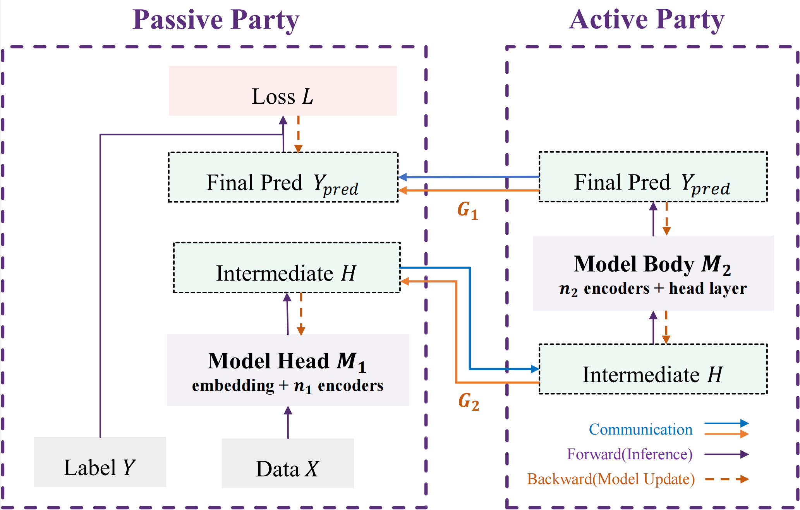
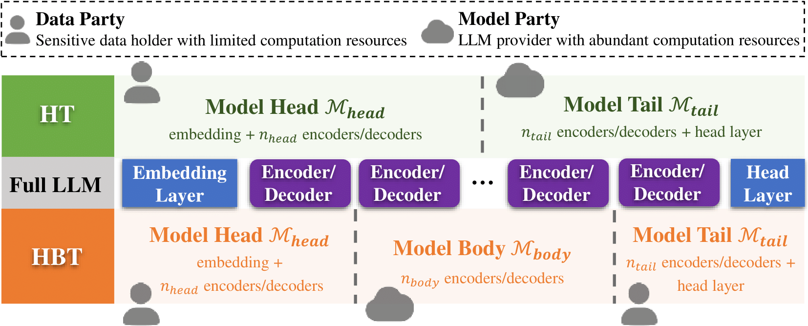
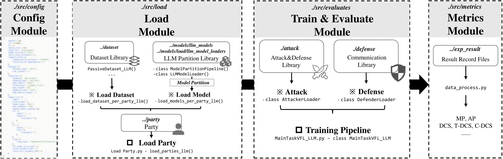

# README_LLM

[VFLAIR-LLM]


## Introduction

In VFLAIR-LLM, we additionally provide support for **Large Language Models (LLM)** inference and fine-tuning using private data, where private data can not be exposed directly to LLM due to privacy and regulation constraints. To overcome this challenge, we leverage VFLAIR to split the LLM into Local and Global sub-models to enable local inference/fine-tuning. In addition, we evaluate the risks of exposing intermediate results and implementing defenses. See figure below for VFLAIR-LLM architecture. 

Figure below demonstrates all the main functions supported by VFLAIR-LLM, including model split, LLM models, tasks and datasets, attack and defense strategies.
 

- **SL-LLM Scenario**: In VFLAIR-LLM, we propose a split learning for LLM scenario describing 2 parties jointly train a LLM. The Model Party holds the global part of the model, representing model provider with abundant computational resources. The Data Party holds the local part of LLM, representing companys or institutes with limited resources. In VFLAIR-LLM, two model partition setting is provided. Detailed scenario description, including model forward and backward calculation, is demonstrated in the following figure.
<div align=center>
                           


</div>

- **Two Model Split Method for LLM**: 

  - **Head-Tail(HT) Partition**: In this setting, we split a full LLM into Model Head(at passive party) and Model Tail(at active party). Defaultly , the LLM between the first and second layer(encoder or decoder), which can be user-defined through config files.

    - Model Head: Embedding Layer + $n_{head}$ encoder/decoders
    - Model Tail: the rest $n_{tail}$ encoder/decoders + Head Layers for down-stream tasks
  - **Head-Body-Tail(HBT) Partition**: In this setting, we split a full LLM into 3 parts: Model Head(at passive party), Model Body(at active party) and Model Tail(at passive party). 
    - Model Head: Embedding Layer + $n_{head}$ encoder/decoders
    - Model Body: the middle $n_{body}$ encoder/decoders
    - Model Tail: the rest $n_{tail}$ encoder/decoders + Head Layers for down-stream tasks
  - For detailed implementation of LLM model split, please refer to [Detailed Tutorial] section for further guidance. Specifc partition point($n_{head}/n_{body}/n_{tail}$) can be user defined through configuration files.
  - Figure below describes the LLM model partition method.

<div align=center>

</div>

- **Three Model Architects and corresponding task types**: Currently VFLAIR supported the following model architect. Each model architect can be used in its corresponding downstream tasks and datasets.
  - **CLS models** output probability vectors for the classification, which is used in normal Classification tasks. When the number of classes is reduced to 1, the model only output a single value which can be used in Regression tasks.
  - **TQA model**s output the starting and ending positions of the answer texts, which can be used in Text-span based Question Answering datasets like SQuAD. (Note that different from Generation-based QA tasks, TQA provides a piece of text for the model to find the answer in while GQA is a proper generation task)
  - **CLM models** output a word vector representing the probability of each token in the next position, which can be used in Next Token Prediction tasks like Lambada. When the model is called recursively to continuously generate the next word, the model can be used for a wider range of generative tasks like Text Generation/Code Generation/Math Problem Solving etc. Similar to CLM models, MM models accepts multi-modal data as inputs, which can be used in various Multi Model tasks like VQA. 

| Model Architect                             | Corresponding Transformer Class                              | Task Type                                                    | Dataset                                      |
| ------------------------------------------- | ------------------------------------------------------------ | ------------------------------------------------------------ | -------------------------------------------- |
| CLS<br>(Classification)                     | XXXforSequenceClassification<br>e.g. transformer.BertforSequenceClassification | Sequence Classification<br>Regression                        | GLUE Benchmark<br>Yelp                       |
| TQA<br>(Text-span based Question Answering) | XXXforQuestionAnswering<br/>e.g. transformer.BertforQuestionAnswering | Text-span based Question Answering                           | SQuAD                                        |
| CLM<br>(Causal LM - generation)             | XXXforCausalLM<br/>e.g. transformer.GPTLMhead                | Next Token Prediction<br>Text Generation<br>Code Generation<br>Math Problem Answering | Lambada/<br>Alpaca/CodeAlpaca/<br>MATH/GMS8K |
| MM<br>(MultiModality - generation)             | /                | Visual Question Answering | TextVQA |


- **Multiple Model Base**: The following LLMs are supported in VFLAIR.

| **Structure type** |                      **Supported LLMs**                      |
| :----------------: | :----------------------------------------------------------: |
|  **Encoder-only**  |                        Bert   Roberta   Albert                     |
|  **Decoder-only**  | GPT2  Llama2 Baichuan2 ChatGLM2 Qwen2 Gemma Falcon  Mamba Mistral DeepseekV3 Qwen2-VL MiniCPM |
|  **Encoder-DEcoder**  | T5 |

- **Two Pipelines: Finetune&Inference** : Currently we support the following pipelines for LLM usage
  - Inference: In this pipeline, user can load their own/third-party pretrained LLMs into the framework and do direct inference on the test dataset.
  - Finetune: In this pipeline, user can finetune their own LLM on a pretrained or raw LLM on a downstream dataset


## Structure
<div align=center>

</div>

VFLAIR-LLM is developed under the VFLAIR framework, sharing the same framework structure as described in [VFLAIR Framework Strcuture][https://github.com/FLAIR-THU/VFLAIR/blob/main/README.md]. The overall strcutrue can be arranged into the following modules:

- **Config Module**

  - refer to `./src/config/Readme_LLM.md` for detailed guidance about configuration file format.

- **Load Module**

  - **Load Party** - `./src/party/llm_party`

    Based on the original class 'Party', we rewrite it as Party_LLM() to cater the need of LLM finetuning&inference.

    - **Load Dataset** - `./src/dataset/party_dataset`
      - Process and generate dataset. 
    - **Load Model** - `./src/models/llm_model`
      - In this file , we rewrite the model classes from transformer to implement model split for LLMs. Detialed model partition method can be user-defined through config files.

- **Train & Evaluate Module**

  - **Finetune&Inference Pipelines** - `./src/evaluate/MainTaskVFL_LLM`
    - Provide Class MainTaskVFL_LLM() to finetune your own LLM or evaluate a pretrained LLM.
      - LoRA algorithm is also provided for fine-tuning
  - **Attack&Defense**: 
    - Attacks：
      - Model Inversion Attacks:
        - VanillaModelInversion - WhiteBox([paper]([Model Inversion Attacks that Exploit Confidence Information and Basic Countermeasures | Proceedings of the 22nd ACM SIGSAC Conference on Computer and Communications Security](https://dl.acm.org/doi/10.1145/2810103.2813677))) 
        - Relaxation-based White Box Inversion([paper]([2004.00053\] Information Leakage in Embedding Models (arxiv.org)](https://arxiv.org/abs/2004.00053)))
        - Bi-directional Semi-white-box Reconstruction([paper](https://arxiv.org/abs/2409.00960))
      - Label Inference Attacks
        - Batch-level Label Inference ([paper](https://ieeexplore.ieee.org/abstract/document/9833321/))
        - Norm-based Scoring (NS) ([paper](https://arxiv.org/abs/2102.08504))

    - Defense：
      - Differential Privacy([paper](https://ieeexplore.ieee.org/document/9152761))
      - Adversarial Training - Privacy Preserving Mapping([paper](https://ieeexplore.ieee.org/document/9152761))
      - Mutual Information Defense([paper](https://arxiv.org/abs/2301.01142))
      - Sparsification([paper](https://openreview.net/forum?id=SkhQHMW0W))
      - TextObfuscator([paper](https://aclanthology.org/2023.findings-acl.337/))
      - SanText([paper](https://aclanthology.org/2021.findings-acl.337/))
      - CusText([paper](https://aclanthology.org/2023.findings-acl.355/))
      - RanText([paper](https://arxiv.org/abs/2310.12214))
      - Split-and-Denoise([paper](https://arxiv.org/abs/2310.09130))

  - **Communication**: currently we only provide FedSGD for SL-LLM communication.

- **Metrics Module**: we provide the following metris for each task type
  - Classification: accuracy 
  - Regression: mse / pearson corr
  - Next Token Prediction: accuracy
  - Text Generation: rouge2/code-bleu...
  - Math Problem Answering: accuracy score


## A Quick Start

1. Download your LLM model file into `././LLM_Models/`

- Your can define your model file in the config files

2. Write your configuration file as instructed in `./src/config/Readme_LLM.md` 

3. Launch your task with:

```
python main_pipeline_llm.py --configs Your_Config_File
```


## Detailed Tutorial

### How to write a configuration file for SL-LLM?

In VFLAIR-LLM, we provide some basic prompt generation methods. Also, user can easily implement self-defined promptin

#### Basic Parameters

```json
"epochs": 100,
"lr": 0.0005,
"k": 2,
"batch_size": 1,
"pipeline": "finetune",
```
- "pipeline": finetune/pretrained
  - whether the pipeline is to finetune a base model/another pretrained model checkpoint or using a pretrained model directly for inference


#### Tokenizer

```json
"tokenizer":{
        "padding": "max_length",
        "padding_type": "outside",
        "pad_token": "[PAD]",
        "truncation": "longest_first",
        "max_length": 30,
        "padding_side": "left",
        "add_special_tokens": 1
}
```
- "padding": padding method 
  - do_not_pad / max_length / longest
- “pad_token”: the token used for padding, usually [PAD]
- "padding_type": add [PAD] inside special tokens like [CLS] [SEP] or outside them
- "max_length": max padding length
- "add_special_tokens": whether to add special tokens like [CLS] [SEP]

#### Communication Protocol

> Currently only FedSGD is supported for VFLAIR-LLM

```json
"communication":{
    "communication_protocol": "FedSGD",
    "iteration_per_aggregation": 1
}
```

### Fine-tune Strategy

```json
"finetune_configs":{
        "name":"Vanilla",
        "configs":{}
  }

"finetune_configs":{
        "name":"LoRA",
        "configs":{
            "r":4,  
            "lora_alpha":32, 
            "lora_dropout":0.1
        }
  }
```

- "name": 'Vanilla'&'LoRA'
  - name of your finetuning strategy. Currently we provide 2 strategy of 'Vanilla' and 'LoRA'. The LoRA algorithm is implemented with the PEFT([code base]([Mangrulkar, S., Gugger, S., Debut, L., Belkada, Y., Paul, S., & Bossan, B. (2022). *PEFT: State-of-the-art Parameter-Efficient Fine-Tuning methods*. https://github.com/huggingface/peft. https://github.com/huggingface/peft)) framework for easy usasge.
- "configs": detailed configuration for LoRA algorithms, name of the parameters is the same as in PEFT framwork.

#### Dataset
```json
"dataset":{
    "dataset_name": "SQuAD",
    "num_classes": 1,
    "n_shot": 1
}
"dataset": {
      "dataset_name": "yelp-polarity",
        "num_classes": 5
}
"dataset":{
        "dataset_name": "GMS8K"
},
```
- "dataset": the dataset for experiments
  - "dataset_name": name of the dataset
  - "num_classes": number of classes for classification experiments. defaultly set to 1 for other tasks.
  - "n_shot": Prompt generation method can be user-defined through this parameter. n_shot represents the number of shots needed for prompt generation
    - e.g n_shot=0[zero-shot]  n_shot=1[one-shot]

#### Model Parameters

> Currently only FedSGD is supported for VFLAIR-LLM

```json
"model_list":{
    "name": "textattackbert-base-uncased-SST-2",
    "model_type": "Bert",
    "max_sequence": 512,
    "kwargs_model_loading":{
    },
    "0": {
      "path": "path/textattackbert-base-uncased-SST-2",

        "head":{
            "trainable": 1,
            "embedding_trainable": 0,
            "encoder_trainable": 0,
            "encoder_trainable_ids":[]
        },
        "tail":{
            "trainable": 1,
            "head_layer_trainable": 0,
            "encoder_trainable": 0,
            "encoder_trainable_ids":[]
        }
    },
    "1": {
      "path": "path/textattackbert-base-uncased-SST-2",
        "body":{
            "trainable": 1,
            "encoder_trainable": 0,
            "encoder_trainable_ids":[]
        }
    },
    "task":{
        "task_type": "SequenceClassification"
    },
    "vfl_model_slice_num": 3,
    "local_encoders_num": 3,
    "local_tail_encoders_num": 3
}
```
- "0"/"1": mark party id. In a 2-party setting, "0" refers to data party while 1 refers to model party.
- "head"/"body"/"tail": mark specifications for each model slice.
  - "trainable": whether this model slice is trainable or frozen during training.
    - Detailed trainable parameter settings can be specified through "head_layer_trainable"/"encoder_trainable" etc. However this is generally not needed.
    - "head_layer_trainable": define whether we shall freeze the head layer paramaters or leave it open for finetuning
    - "encoder_trainable": define whether we shall freeze the encoder/decoder paramaters or leave it open for finetuning. Detailed number of encoder that's trainable is defined in "encoder_trainable_ids".
    - "embedding_trainable": define whether we shall freeze the embedding layer paramaters or leave it open for finetuning
- "path": model path
- "kwargs_model_loading": Other configurations for model loading , specified as same as transformers' `from_pretrained()` function. For example, you can set 'device_map' here.
- "max_sequence": max length of input acceptable for the model.
- "task": Definition of task type
  - "task_type": name of the task type(SequenceClassification...)
- **model partition params**:
  - "vfl_model_slice_num": number of partitioned model slices, 2 or 3
  - "local_encoders_num": number of encoders/decoders allocated to model head
  - "vfl_model_slice_num": only specified under 3-slice settings to mark the number of encoders/decoders allocated to model tail(at passive party)

#### Attack

```json
"attack_list": {
        "0":{
            "name": "VanillaModelInversion_WhiteBox",
            "parameters": {
                "party": [1],
                "lr": 0.01,
                "epochs": 100,
                "batch_size": 32
            }
        }
}
```
- "name": the name for the attack
- "party": attacker party id

#### Defense

```json
"defense": {
        "name": "AdversarialTraining",
        "parameters": {
            "party": [0],
            "adversarial_model": "Mapping_MLP3",
            "adversarial_model_lr": 0.05,
            "imagined_adversary": "ImaginedAdversary_MLP3",
            "imagined_adversary_lr": 0.05,
            "lambda": 0.5,
            "seq_length": 30,
            "embed_dim": 768
        }
}
```
- "name": name of the defense
- "parameters": parameters used in constructing the defense, including hyper-parameters, defense model path etc.


### How to add New LLMs?

All models on huggingface can be directly loaded into VFLAIR-LLM as we support the same `.from_pretain(YOUR_MODEL)` API in the framework.

Note that you should identify the type of model pretrained (e.g. CausalLM...) in configuration file first. Models that can be imported with the following API can be used in VFLAIR-LLM:

- AutoModel.from_pretrained()
- AutoModelorCausalLM.from_pretrained()
- AutoModelorSequenceClassification.from_pretrained()
- AutoModelforQuestionAnswering.from_pretrained()

1. Download your model in to `../Your_Model_Path/Your_Model_Name`
2. Add your model path and name pair into `.src/load/Load_Model.py`
3. Write a proper configuration file according to tutorial
4. Launch your task with:

```
python main_pipeline_llm.py --configs Your_Config_File
```
If your LLM is not supported in our current LLM types, Please refer to  `../usage_guidance/How to add a new LLM.md` for more information.


### How to add New Datasets?

If you need detailed usage guidance for existent datasets and guidance for adding new datasets , Please refer to  `../usage_guidance/Dataset_Usage.md` for more information.


## Other Details

### Prompt Generation

In VFLAIR-LLM, we provide some basic prompt generation methods. Also, user can easily implement self-defined prompting techniques based on our tutorials.

- **Zero-shot& Few-shots**: Number of  shots used can be alter through the config parameter *n-shot* in configuration files .
- **User-defined Prompting Method**: In `./src/load/Load_Dataset.py`, we provide function `load_dataset_per_party_llm()` for dataset loading and promp generation. Users can easily alter the prompting method here.
